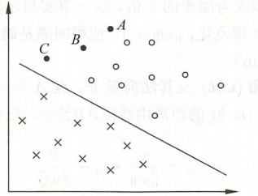

# 核函数

## 预备知识

1. 线性可分支持向量机的分类超平面为：$\pmb{w^*}\pmb{x}+b^*=0$，其相应的分类决策函数为$f(\pmb{x}）=sign(\pmb{w^*}\pmb{x}+b^*)$

2. 根据对偶问题可知：$\pmb{w^*}=\displaystyle\sum_{i=1}^N\pmb{\alpha^*}y_i\pmb{x_i}, b^*=y_j-\displaystyle\sum_{i=1}^Ny_i\pmb{\alpha_i^*}(\pmb{x_i}\pmb{x_j})$,其中$y_j$对应的样本为支持向量。

3. 根据1,2可知，分类决策函数为：
   
   $$
   f(\pmb{x})=sign(\displaystyle\sum_{i=1}^N
\pmb{\alpha^*}y_i\langle \pmb{x_i},\pmb{x}\rangle+b) \tag{4.1}
   $$

## 正文

### 线性可分与线性不可分：

        以下图所示的二维特征空间中的分类问题为例，在这种情况下，找到能将两类数据正确划分并且间隔最大的直线即可，所以为线性可分：

但是，现实问题常常存入如下线性不可分的情况，如下图所示：

判定边界的模型可能是：$h_{\theta}(x)=\theta_0+\theta_1x_1+\theta_2x_2+\theta_3x_1x_2+\theta_4x_1^2+\theta_5x_2^2+...$的形式。用新的特征$f$来替换模型中的每一项，令：$f_1=x1,f2=x_2,f3=x_1x_2…$，也就是将低维特征映射到高维空间，得到：$h_{\theta}(x)=\theta_0+\theta_1f_1+...+\theta_nf_n$。

上面我们根据多项式经验，构造了新的特征$\pmb{f}$。那么，在给定样本量m，原有特征数为k的情况下，新特征该怎么构造呢？ 在[课时97-核函数2]([吴恩达机器学习 - 网易云课堂](https://study.163.com/course/courseLearn.htm?courseId=1210076550#/learn/video?lessonId=1280907414&courseId=1210076550)) 中，我们构造m+1个新特征。对于给定的样本$(x^{(i)},y^{(i)})$（与《统计学习方法》的表达有些差异，第i个样本点表示为$x_i,y_i$）其新特征为：

新特征为给定样本与训练集中所有样本的距离。

### 核技巧

        由上可知，将低维特征映射到高维空间，则可以处理线性不可分的情况。但是将低维映射到高维$\pmb{x}->\phi(\pmb{x})$，存在一定计算量，如$f_1=x1,f2=x_2,f3=x_1x_2…$。此外，$\langle \pmb{x_i},\pmb{x}\rangle->\langle \phi(\pmb{x_i}),\phi(\pmb{x})\rangle$计算量也会增大。根据式4.1可知，SVM决策函数最终是要得到$\langle \phi(\pmb{x_i}),\phi(\pmb{x})\rangle$，如果有函数$K(\pmb{x_i},\pmb{x})=\langle \phi(\pmb{x_i}),\phi(\pmb{x})\rangle$，这样就不用构造$\phi(\pmb{x})$，也避免直接在高维空间中进行计算，而结果却是等价的！这时就可以用核函数，直接采用《统计学习方法》上的核函数定义：

### 常见核函数

    其中，高斯核函数通过泰勒展开可以将X映射到无穷维。如果$\sigma$很大，高次特征上的权重衰减得很快，所以实际上相当于一个低维的子空间；相反，如果$\sigma$很小，则可以将任意的数据映射为线性可分，但存在过拟合问题。不过，总的来说，通过调控参数，高斯核实际上具有相当高的灵活性，也是使用最广泛的核函数之一。下面总结下高斯核函数：

- $\sigma$较大时，可能会导致低方差，高偏差；

- $\sigma$较小时，可能会导致低偏差，高方差。
