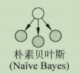
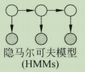

# 从朴素贝叶斯到隐马尔可夫模型

## 预备知识

1. **概率有向图模型的联合概率公式**

$$
P(x_1,...,x_n)=\displaystyle\prod_{i=1}^{n}P(x_i|\pi(x_i)) \tag{1.1}
$$

其中：$\pi(x_i)$为$x_i$的父节点，即$x_i$依赖$\pi(x_i)$。

2. **朴素贝叶斯模型的后验概率**

$$
P(Y=q_k|X=(v^{(1)},...,v^{(n)}))=
\frac{P(Y=q_k)\displaystyle\prod_jp(X^{(j)}=v^{(j)}|Y=q_k)}
{\displaystyle\sum_kP(Y=q_k)\displaystyle\prod_jp(X^{(j)}=v^{(j)}|Y=q_k)} 
\tag{1.2}
$$

3. **生成式模型与判别式模型**
   
   生成式模型与判别式模型的本质区别在于模型中观测序列$x$和状态序列$y$之间的决定关系，前者假设$y$决定$x$，后者假设$x$决定$y$。所以，生成式模型对$p(x,y)$建模，判别式模型对$p(y|x)$建模。

4. **应用示例**

为了便于后面模型的应用，先假设有一批词性标注的语料。即：

- 若干条已分好词的句子
- 每个句子中词的词性（注意：同一个词可以有不同的词性，例如一打汽水，打是量词，而打灯笼，打是动词）。

可以看出，通常从句子中提取特征feature，句子中词的词性是待预测的label。

## 正式开始

### 朴素贝叶斯NB

使用朴素贝叶斯进行分类，使$P(Y=q_k|X=(v^{(1)},...,v^{(n)}))$最大的$q_k$即为预测的类别。在式(1.2)中，分母对所有的$q_k$都是相同的，所以

$$
y_{max}=p_{max}(x,y)=argmax{P(Y=q_k)\displaystyle\prod_jp(X^{(j)}=v^{(j)}|Y=q_k)}  \tag{2.1}
$$

也就是针对联合分布$p(x,y)$进行建模，是生成概率最大的$p_{max}(x,y)$获取类别$q_k$。所以NB是生成式模型。

再来看看NB的概率图模型，如下图所示，灰圆$X^{(i)}$，只依赖白圆`Y`。

根据式(1.1)，可得$P(X^{(1)},...,X^{(n)},Y)=P(Y)\displaystyle\prod_{i=1}^{n}P(X^{(i)}|Y)$与NB的后验概率的分子对比，他们是一样的，只是NB具体化了$X^{(i)},Y$的取值。

代入4.应用示例数据来看，使用NB，有哪些是$X^{(i)}$呢？

个人认为，分好的`词`、`词在句子中的index`、`句子的末尾符号`可以作为$X^{(i)}$（大家也可以选择其他的特征），而待预测的词性为`Y`。特征选好之后，可以使用极大似然估计/贝叶斯估计方法计算先验概率$P(Y=q_k)$及条件概率$P(X^{(j)}=a_{jl}|Y=q_k)$，最后计算后验概率，取后验概率最大的词性作为预测。

这样有什么问题呢？一般来说，不同词性($Y$)之间存在转换概率的，例如上一个词是形容词，那么下一个词是名词的概率为0.7，是动词的概率为0.3，是介词的概率为0，是连词的概率为0……所以$Y$变成了一个词性序列，而不再是单个词的词性。换句话说，当处理问题由点(单个词的词性)转变成线(一句话的词性序列)，就需要引入以朴素贝叶斯模型为基础的隐马尔可夫模型了。

### 隐马尔可夫模型HMM

HMM有两个基本假设：

- 齐次马尔科夫性假设，即在任意$t$时刻的状态只依赖于前一个时刻的状态，与其他时刻的状态和观测无关。

- 观测独立性假设，即任意时刻的观测只依赖于该时刻的状态，与其他观测及状态无关。

基于这两个基本假设，HMM的概率图模型，如下图所示：

白圆表示状态$i_t$(也就是NB中的Y)，灰圆表示观测$o_t$(也就是NB中的X)，可以看出$i_t$只依赖于状态$i_{t-1}$，$o_t$只依赖于$i_t$。

所以NB加上序列，满足齐次马尔科夫性，就是HMM。举个例子，根据上文，在朴素贝叶斯里，分好的`词`、`词在句子中的index`、`句子的末尾符号`可以作为$X^{(i)}$，而待预测的词性为`Y`。当一次次的预测词性$Y$作为白圆$i_t$，由于当前词性依赖于上一次词性，所以形成有向边；多个$X^{(i)}$合成一个灰圆$o_t$，且依赖于本次的词性$Y$(即$i_t$)，这时概率图模型就和HMM一样了。所以，HMM是以NB为基础处理线性序列问题的模型。

由式(1.1)可知HMM的联合概率：

$$
P(i_1,o_1,...,i_t,o_t,...,i_T,o_T)=\displaystyle\prod_{t=1}^{T}P(i_t|i_{t-1}))P(o_t|i_t) \tag{2.2}
$$

所以，$P(i_t=q_j|i_{t-1}=q_k)$,$P(o_t=v_l|i_t=q_j)$是HMM模型的参数，当$t=1$时，是初始状态，没有上一个状态依赖，$P(i_1=q_m)$也是HMM的参数。总结一下，HMM包含三个要素：

- 状态转移概率矩阵 $A=[a_{ij}]_{N×N}$

- 观测概率矩阵 $B=[b_j(k)]_{N×M}$

- 初始状态概率向量 $\pi=(\pi_i)$

因此，HMM可以用三元符号表示，即  $\lambda=(A,B,\pi)$

`A、B、π`可采用**极大似然估计法/Baum-Welch算法**来学习得到，这是HMM的**学习问题**。算法详情见《统计机器学习第二版》P203~207。

此外，HMM还包含所有可能的状态集合$Q$，所有可能的观测集合$V$。而$Q$和$V$根据已有训练数据，可以直接得到。以5.应用示例为例，以词为特征的话，$V$是词集合，$Q$为词性集合。

除了学习问题，HMM还能解决**概率计算问题**，也就是在给定模型$\lambda=(A,B,\pi)$和观测序列$O=(o_1,...,o_t,...,o_T)$，计算$P(O|\lambda)$。举个例子，`南京市长江大桥主持会议`为`南京市长 江大桥 主持 会议`的概率。怎么计算呢？

根据全概率公式

$$
P(O|\lambda)=\displaystyle\sum_IP(O|I,\lambda)P(I|\lambda)
=\displaystyle\sum_IP(O,I|\lambda) \tag{2.3}
$$

根据联合概率公式

$$
P(i_1,o_1,...,i_t,o_t,...,i_T,o_T|\lambda)
=\pi_{i_1}b_{i_1}(o_1)a_{i_1i_2}b_{i_2}(o_2)...a_{i_{T-1}i_T}b_{i_T}(o_T)
\tag{2.4}
$$

将式（2.4）代入式（2.3）得

$$
P(O|\lambda)=\displaystyle\sum_IP(O,I|\lambda)
=\displaystyle\sum_I\pi_{i_1}b_{i_1}(o_1)a_{i_1i_2}b_{i_2}(o_2)...a_{i_{T-1}i_T}b_{i_T}(o_T)
\tag{2.5}
$$

式（2.5）计算量是很大的，假设状态的取值有N种可能，那么长度为T的状态序列，有$N^T$种可能，每一种状态序列计算复杂度$O(T)$，是O(TN^T)阶。所以通常采用**前向算法/后向算法**，算法详情见《统计机器学习第二版》P198~203。

在4.应用示例中，我们的目标是给定分词好的句子（观测序列），求最有可能的词性序列（状态序列）。官话就是，给定模型$\lambda=(A,B,\pi)$和观测序列$O=(o_1,...,o_t,...,o_T)$，找出使$P(I|O)$最大的$I$，这是HMM的**预测问题**，通常采用**近似算法/维特比算法**来预测，算法详情见《统计机器学习第二版》P208~212。

## 总结：

    由上文可知，HMM已NB为基础，用于处理线性序列问题，广泛应用于语音识别、汉语自动分词与词性标注和统计机器翻译等自然语言处理任务。

参考文献：

李航 .统计学习方法(第二版). 清华大学出版社.

宗成庆.统计自然语言处理(第二版).清华大学出版社.
